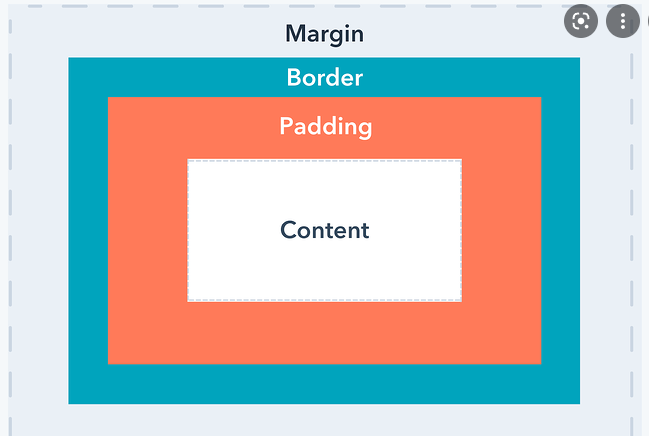

# CSS

**Cascading Style Sheets**

[HTML Cheatsheet](https://htmlcheatsheet.com/) Includes properties, selectors, background generator, button generator etc...

## Floats & Clears

```CSS
img {
  float: left;
  margin-right: 20px // optional
}
```

ex. you have a paragraph after an image, using `float:left` the text wraps on the right side of the image.

float brings items up in the air and lets other things go underneath it other than text.

```CSS
p {
  clear: both;
}
```

using `clear: both` the p element takes up all the space and starts after the img. text wont go underneath because it will pretend the item above isn't float and will start on the next line.

ex. you have 2 boxes you want next to eachother. use `float:left` on left box and `float:right` on right box. they will be next to eachother if there is enough space.

If first element is floating left, it is possible that the second block is beneath the floating one. Solve this by adding the float property left to the second block to have no overlap between the two blocks.


By doing this the third box is having the same problem as the scond one. it is now beneath the first box.

If you add float left to all the boxes there will be a horizontal line that wraps around on the next line if the screen width gets narrow.

note: when floating right it will reverse the order. completely right is box 1.

`clear:both` forces a new line. ignore the things that are floating above it and instead come down on the next line.

`clear:right` only pays attention to items floating to the right. if there are none nothing happens. Same with `clear:left`

## Positioning

### Static Positioning

Is default position all elements will have. Static makes it so elements are shown in chronological order.

ex. child element one will be above child element two.

### Relative Position

Acts exactly as static positioning but it allows you to do 4 specific things that static does not.

It allows you to change the `top, left, right, bottom`. It takes the element out of the document flow and moves it in the specified direction.

### Absolute Position

completely removes the element from the document flow and everything else renders as if the absolute element doesn't exist


Usefull when you want to stick an element in a specific position but you don't want anything else moving around because of it.

When using the top, left, bottom, right properties they are now calculated from the parent element. To make a parent set `position:relative`. The child element will stick to any parent that's not static.

### Fixed Position

These elements are positioned based on the entire HTML element. They also stay in place when you scroll.

### Sticky Position

Combination of both relative position and fixed position. Positions itself relative to other elements but when scrolled down it will become fixed and stay in the same place.

## Display

Default display property is `display:block` which means it will take up the entire width given to it. All the content has to be above it or below it.


**RED & GREEN** => `display:block` takes up entire width

**CYAN** => `display:inline` takes up the minimum needed space to fit content.

**IMAGE** => `display:inline-block` takes up the minimum needed space to fit content. using this display property allows you to set the `width` & `height` of the element.

`display:none` makes the element disapear, takes up no space.

`display:flex` more on that later in the document

`display:grid` more on that later in the document

## Box Model

**Everything in CSS is a box of either a rectangular shape or a square shape**




**Margin collapses between two elements that are next to eachother.**

- Whatever margin is largest is the one that will be used.
- Margin doesn't count in to the actual height of an element.
- To include the margin into the actual height of an element use `box-sizing:border-box` this subtracts the padding and the margin from the content. so that the original defined `height` & `width` is the size the box takes.

Good way to learn more about the box model is playing around in the chrome dev tools.

It is easier to use `box-sizing:border-box` because you won't have to do math in your head and the box will stay the origionally indented size.

## Flex Box

[Flex Froggy](https://flexboxfroggy.com/#nl "flex box exercises") visual exercises for flexbox.


`display:flex` allows the boxes to line up next to eachother and take up the `width` if there is space. if the screen gets to small the boxes will shrink. To position the boxes on the `Main Axis` use `justify-content`. To position the content on the `Main Axis` use `align-items`. The property `align-content` property should be used for multi-line flex box containers. This in combination with `flex-wrap` on the container makes the items shift to different lines to keep the same `width`. There are multiple properties for all of those below.

Properties **justify-content**:
- `center`
- `space-between`
- `space-around` even space around all flex items

Properties **align-content**:
- `stretch` default property, take up the most possible space
- `flex-start` takes up the intended size at the top of the container
- `flex-end`  takes up intended size at end of container 
- `center` align items on the main axis with the intended size

Properties **align-content**:
- `center` 
- `flex-start` aligns items starting from top  
- `flex-end` aligns items starting from bottom
- `space-between`

`align-content` doesn't get used as often. `justify content` and `align items` are properties that get used the most since they align your individual rows along the main and cross axis.

`flex-direction: column` 

`flex-direction: row` 

`flex-shrink: 0` makes it so that box doesn't change in size. The container needs to be `display:flex`. 

`flex-grow:1` tell our box or boxes to grow bigger so if we increase our screen size this to fill up all the available space. You can change the number to increase in size.

`flex-basis:0` tell our box or boxes to ignore given width and divide space according to `flex-grow`values.

`align-self` works same as align content but for individual boxes.


## CSS Grid

[Grid Garden](https://codepip.com/games/grid-garden/#nl "flex box exercises") visual exercises for CSS Grid.


```CSS
.grid-container {
  display: grid;
}
```
`display:grid` is not enough to get a grid you need to specify

`grid-template-columns: 200px 100px` column one 200px and column two 100px wide.

`grid-template-columns: 2fr 1fr` working with fractions works the same as `flex-grow` property

`grid-template-columns: repeat(4,100px)` repeats the 100px wide columns

all the same properties for `grid-template-rows`

the height of the rows will now be determined by the content it is given. You can change the height by:

`grid-auto-rows: 150px`

`grid-auto-rows: minmax(150px,auto)`

You can get space between the boxes using:

`gird-row-gap: 20px` 20px between rows

`gird-column-gap: 20px` 20px between column

`gird-gap: 20px` row and gap in one 

### Grid Template


It is also possible to use `grid-column-start:1`and `grid-column-end:3` to make elements span over multiple rows/columns


A better alternative is `grid-row: span 2` and `grid-column: span 3`. span 1 is the default

You can use the `justify-content`, `align-content` properties to position the grid. Just like flexbox. Default values are `stretch`

Each box also has the `align-self: start` , `justify-self` properties, same as flexbox.


## Responsive design and Media Queries

### CSS Units

- Absolute units (px, cm, mm, ...)
- Percentages (relative to their parent, except on height, where things get weird)
- Relative units
  - relative to font-size (used the most)
    - `em` and `rem`
  - relative to the viewport (=browser window)
    - `vw`, `vh`, `vmin`, `vmax`

**Change width from px to % wherever possible**

`min-width`

`max-width`

**em unit**

Relative units are always relative either to a font-size or the size of the viewport.

for those which are relative to a font-size, which font-size they are relative to depends on a few thing, which complicates the matters.

- em are relative to their parent's font-size
  - font-size is an inherited property, so if you don't declare it anywhere, it's getting it from the body (or the default which is normally 16px)

problem with em: it can create a cascading effect so you should use rems instead.

**rem unit**

The rem unit is short for Root Em.

That means it's always relative to the "root" of our document.

The root of an HTML page is always the html element itself

The parents have to be declared using `rem` if you declare them using an absolute unit it will take that value.

When to use `rem` and `em` :
- Font-size = `rem`
- Padding and margin = `em`
- Widths = `em` or `%`

### Media Queries

most common:

`@media (min-width: 960px) { ... }` 960px and bigger

`@media (max-width: 960px) { ... }` 960px or smaller

`@media (min-width: 400px) and (max-width: 960px) { ... }` 400px up until 960px

`@media (orientation: landscape)`allows us to target the height of screens. 

The order is really important.

## Pseudo Elements

`::before` & `::after` allow you to add elements strictly from CSS right before or right after an element.

usage: `classname::before`


You can only use pseudo elements on elements that have content.


example: `*` after every required field in a form. `required::after { content: '*';}` now you can use the required class easily.


