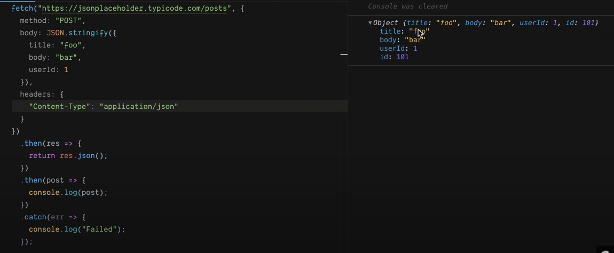
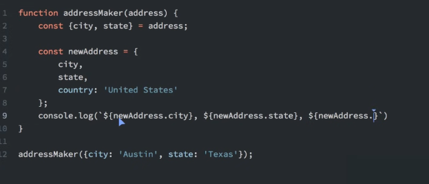
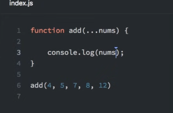
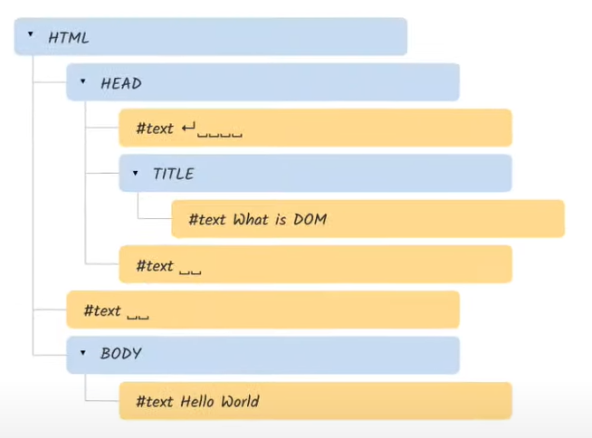

# Javascript

## Dom Manipulation

`const body = document.body` when you have the body it's easy to append items to it.

`body.append("hello world", "")` with append you can append strings with `body.appendChild()` you can append divs, spans etc..

### Creating elements

`const div = document.createElement('div')`

### Modifying element text 

`div.innerText = "hello world"`

`div.textContent = "hello world 2"` is the content straight from the html, if you write text on 2 lines it will be like that in the textContent.

the difference between `innerText` and `textContent` is that when you put something on `display:none` the `textcontent` is not empty. While with `innerText` it is gone.

`body.append(div)`

### Modifying HTML element

`div.innerHTML = <p>tekst<p>` allows html elements to be added. if you allow user input into innerHTML they could write malicious code.

`const item = document.querySelector('#id')` allows getting items

`item.remove()` removes the item from html

### Modifying element attributes

`item.getAttribute('id')` not used that much, can be handy when the property is unknown at that time.

`item.id` is easier way

`item.setAttribute("id","123")`

`item.id = 123` 

### Modifying data attributes

`<p data-test-name="anything">`

`item.dataset.testName` get or set

### Modifying element  classes

`item.classList.add("new-class")`

`item.classList.remove("new-class")`

`item.classList.toggle("class", ?bool)` most common way to use classList

### Modifying element styles

`item.style.color = "red"`


## Learn Fetch API

```JS
fetch('https://localhost:3000/api/list')
  .then(res => {
    console.log('Success');
  })
  .catch(err => {
    console.log('failed');
  })
```

fetch returns a promise, `res` is the result. still gives succes even when you send faulty request.

add `console.log(res.ok, res.status)` allows to see the actual response

you can chain promises:

```JS
fetch('...')
  .then(res = {return res.json()})
  .then(post => {console.log(post)})
```

add parameters in url: `('url/api/post/?var1=123&?var2=123)`



```JS
// Example POST method implementation:
async function postData(url = '', data = {}) {
  // Default options are marked with *
  const response = await fetch(url, {
    method: 'POST', // *GET, POST, PUT, DELETE, etc.
    mode: 'cors', // no-cors, *cors, same-origin
    cache: 'no-cache', // *default, no-cache, reload, force-cache, only-if-cached
    credentials: 'same-origin', // include, *same-origin, omit
    headers: {
      'Content-Type': 'application/json'
      // 'Content-Type': 'application/x-www-form-urlencoded',
    },
    redirect: 'follow', // manual, *follow, error
    referrerPolicy: 'no-referrer', // no-referrer, *no-referrer-when-downgrade, origin, origin-when-cross-origin, same-origin, strict-origin, strict-origin-when-cross-origin, unsafe-url
    body: JSON.stringify(data) // body data type must match "Content-Type" header
  });
  return response.json(); // parses JSON response into native JavaScript objects
}

postData('https://example.com/answer', { answer: 42 })
  .then(data => {
    console.log(data); // JSON data parsed by `data.json()` call
  });
```
---

## ES6+ and modular Javascript

### Template Literals

Allow us to use javascript between backticks `${var1} ${num1 + num2}`

Also lets us use multi-line strings and for special constructs called tagged templates.


## Destructuring Objects

Allows us to write shorthand code as well as reassign values.

```JS
const personalInformation = {
  firstName: 'Jens',
  lastName: 'Bols',
  city: 'Gent',
  state: 'West-Vlaanderen'
 }
```

`const {firstName : fn, lastName : fn} = personalInformation`

takes out those properties and puts them in new variables with those names.

You can also use `: newName` to give the variables new names.

## Destructuring Arrays

`let [firstname, secondname, thirdname] = ['jens', 'andu', 'random'];`

On the left side we choose custom names and this takes into the account the index of the variable. so the first item on the left side array will take the index 0 item on the right side. If you want to skip an element you can use `firstName,,thirdname` 


## Object Literal

In previous versions you always had to write object literals like so: `const newAdress = {city: city, state: state}` with ES6 you can now skip the part after the colon and just write the variable name.



## Spread Operator

allows you to spread an object into an new object or destructure it into multiple items in an array.

## Rest Operator

Is used when you don't know how many items you will get.

;

## Arrows Functions
## Default Params
## Includes
## Let & Const
## Import & Export
## padStart() & padEnd()
## Classes
## Trailing Commas
## Async & Await

last concepts are in this video https://www.youtube.com/watch?v=nZ1DMMsyVyI&t=1355s&ab_channel=freeCodeCamp.org

## Hoisting

Is the process whereby the interpreter appears to move the declaration of functions, variables or classes to the top of their scope, prior to the execution of the code. Hoisting allows functions to be safely used in code before they are declared.

The problems occur when you declare a function and it gets "hoisted" to the top before the variable is defined.

Declarations and functions are hoisted to the top.

Keep in mind that when you assign a function to a variable the variable will be hoisted to the top before the function is defined. It will give a error: uncaught typeError.

All the variables should be declared at the top so it's clear which scope the variables are coming from. Define your functions at the bottom of the scope to keep them out of the way.

## Event Bubbling

Event bubbling is a method of event propagation in the HTML DOM API when an event is in an element inside another element, and both elements have registered a handle to that event. It is a process that starts with the element that triggered the event and then bubbles up to the containing elements in the hierarchy. In event bubbling, the event is first captured and handled by the innermost element and then propagated to outer elements.

```HTML
<div id="parent">
  <button>
    <h2>Parent</h2>
  </button>
  <button id="child">     
    <p>Child</p>
  </button>
</div>
```

```JS
document.getElementById("child").addEventListener("click", function () 
  {
    alert("You clicked the Child element!");
  }, false);
 
document.getElementById("parent").addEventListener("click", function () 
  {
    alert("You clicked the parent element!");
  }, false);
```

By getting the id of the parent and applying a click function to the div. Only 1 function gets executed, the parent function. When you click the child element the parent function also gets executed because you have defined the function on the div. This triggers 2 executions of both functions which may or may not be inteded.

## Scope

### Block Scope

```JS
{
  let x = 2;
}
// x can NOT be used here
```

Variables declared with the var keyword can NOT have block scope.

Variables declared inside a { } block can be accessed from outside the block.

```JS
{
  var x = 2;
}
// x CAN be used here
```

### Local Scope

Variables declared within a JavaScript function, become LOCAL to the function.

```JS
// code here can NOT use carName

function myFunction() {
  let carName = "Volvo";
  // code here CAN use carName
}

// code here can NOT use carName
```

### Function Scope

JavaScript has function scope: Each function creates a new scope.

Variables defined inside a function are not accessible (visible) from outside the function.

Variables declared with var, let and const are quite similar when declared inside a function.

Basically the same a Local Scope.

### Global Scope

```JS
let carName = "Volvo";
// code here can use carName

function myFunction() {
// code here can also use carName
}
```

## Prototype

Prototypes allow you to add properties to an existing object constructor. Say you have multiple properties in an object person. If you were to type `person.nationality = "English"` and the property nationality doesn't exist nothing will happen.

Using prototypes this can be done like so: `Person.prototype.nationality = "English"` The same can be done using methods:

```JS
Person.prototype.name = function() {
  return this.firstName + " " + this.lastName;
};
```
## Shadow DOM

DOM = Document Object Model

Is the node tree format



Shadow dom are elements that are not shown in the html structure. for example if you were to use a video element the buttons on the video don't show up in the DOM. You can enable it in the devtool settings of chrome.
## Strict
