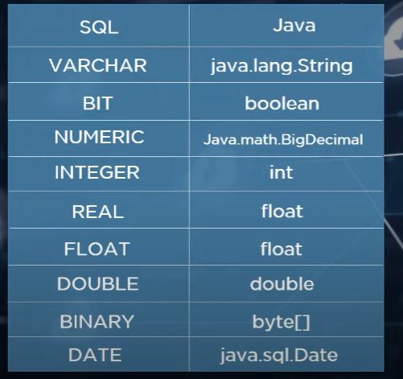
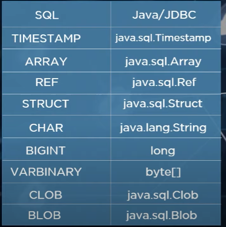
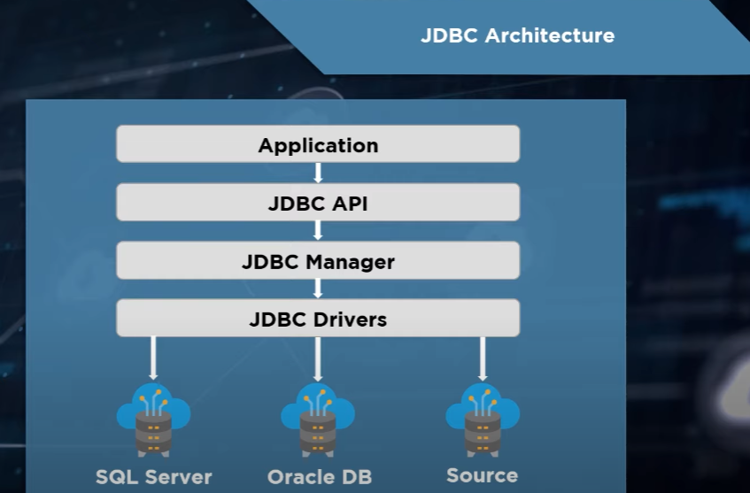

# JDBC
- What is JDBC
- Need of JDBC
- Datatypes in JDBC
- JDBC Architecture
-JDBC Environment Setup
- Steps to Connect JDBC
- JDBC Example

https://www.youtube.com/watch?v=3OrEsC-QjUA&ab_channel=Simplilearn




## Architecture



## JDBC Connection with postgreSQL

```JAVA
public class JDBCPostgreSQLConnect {
	// JDBC URL
	// JDBC Username
	// JDBC Password
	
	private final String url = "jdbc:postgresql://localhost/postgres";
	private final String user = "postgres";
	private final String password = "root";
	
	private void connect() {
		try(Connection connection = DriverManager.getConnection(url, user, password);) {
			if(connection != null) {
				System.out.println(connection);
				System.out.println("Connected to PostgreSQL server");
			} else {
				System.out.println("Failed to connect to PostgreSQL server");
			}
			
			Statement statement = connection.createStatement();
			ResultSet resultSet = statement.executeQuery("CREATE TABLE Persons (\r\n"
					+ "  PersonID int,\r\n"
					+ "  LastName varchar(255),\r\n"
					+ "  FirstName varchar(255),\r\n"
					+ "  Address varchar(255),\r\n"
					+ "  City varchar(255) \r\n"
					+ ");");
			if(resultSet.next()) {
				System.out.println(resultSet.getString(1));
			}
		} catch (SQLException e) {
			e.printStackTrace();
		}
	}
	
	public static void main(String[] args) {
		JDBCPostgreSQLConnect connect = new JDBCPostgreSQLConnect();
		connect.connect();
	}
```


```JAVA
Connection conn = null;
		String url = "jdbc:postgresql://localhost:5432/CSV";
		Properties props = new Properties();
		props.put("user", "postgres");
		props.put("password", "root");
		props.put("currentSchema", "csv");
		props.put("stringtype", "unspecified");
```

https://programs.wiki/wiki/jdbc-core-technology-and-how-to-encapsulate-data.html


Singleton Connection

```JAVA
private static Connection conn;

	public static Connection getConnection() throws SQLException {
		if (conn == null || conn.isClosed()) {
			conn = establishNewConnection();
		}
		return conn;
	}

	private static Connection establishNewConnection() {
		Connection conn = null;
		String url = "jdbc:postgresql://localhost:5432/CSV";
		Properties props = new Properties();
		props.put("user", "postgres");
		props.put("password", "root");
		props.put("currentSchema", "csv");
		props.put("stringtype", "unspecified");

		try {
			conn = DriverManager.getConnection(url, props);
			System.out.println("Connected to db");
		} catch (Exception e) {
			System.out.println("something went wrong connecting to db");
			e.printStackTrace();
		}
		
		return conn;
	}
```